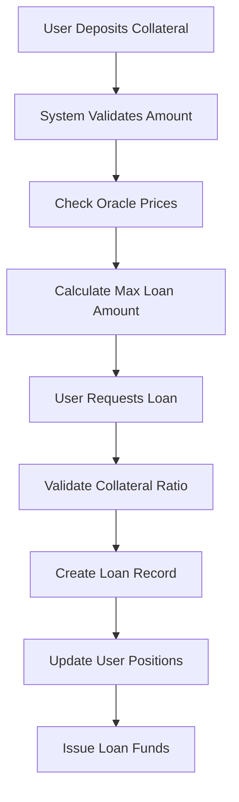
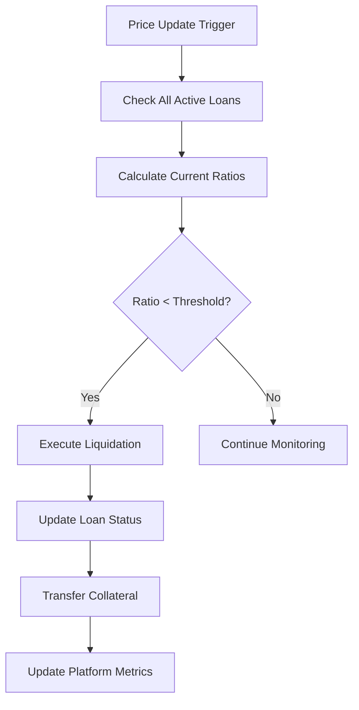
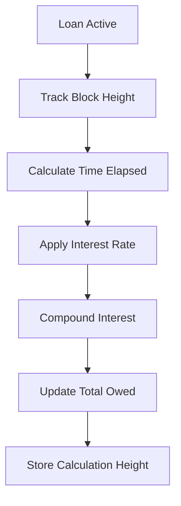

# BitStack Protocol

## Decentralized Bitcoin-Backed Lending on Stacks Layer 2

[](https://stacks.co)
[](https://bitcoin.org)

BitStack revolutionizes Bitcoin DeFi by enabling Bitcoin holders to unlock liquidity without selling their precious sats. Built on Stacks Layer 2, our protocol provides secure, trustless lending backed by Bitcoin collateral with automated risk management.

## 🌟 Key Features

- **Over-Collateralized Lending**: Secure loans with configurable collateral ratios
- **Automated Liquidation Protection**: Smart risk management system prevents bad debt
- **Multi-Asset Support**: BTC and STX collateral acceptance
- **Oracle-Integrated Pricing**: Real-time, accurate asset valuations
- **Transparent Governance**: Community-driven protocol parameters
- **Bitcoin Security**: Inherits Bitcoin's security through Stacks Layer 2

## 🏗️ System Overview

BitStack operates as a decentralized lending protocol where users can:

1. **Deposit Collateral**: Lock Bitcoin or STX as collateral
2. **Borrow Funds**: Obtain loans up to protocol-defined ratios
3. **Maintain Positions**: Monitor health ratios and manage risk
4. **Repay & Retrieve**: Pay back loans with interest to unlock collateral

The protocol maintains system stability through:

- Dynamic collateral requirements
- Automated liquidation mechanisms
- Oracle-based price feeds
- Interest rate calculations

## 🔧 Contract Architecture

### Core Components

```
BitStack Protocol
├── Platform Administration
│   ├── Initialization System
│   ├── Risk Parameter Management
│   └── Oracle Price Updates
├── Lending Operations
│   ├── Collateral Management
│   ├── Loan Creation & Management
│   └── Repayment Processing
└── Risk Management
    ├── Liquidation Engine
    ├── Collateral Ratio Calculations
    └── Interest Calculations
```

### Data Structure

```
Storage Layer
├── loans (Map)
│   ├── loan-id → Loan Details
│   └── borrower, collateral, amount, rates, status
├── user-loans (Map)
│   ├── user → Active Loan List
│   └── Track user positions
└── collateral-prices (Map)
    ├── asset → Price Data
    └── Oracle price feeds
```

### Key Parameters

| Parameter | Default Value | Description |
|-----------|---------------|-------------|
| Minimum Collateral Ratio | 150% | Required overcollateralization |
| Liquidation Threshold | 120% | Automatic liquidation trigger |
| Platform Fee | 1% | Protocol fee on operations |
| Interest Rate | 5% | Annual borrowing rate |

## 📊 Data Flow

### Loan Creation Flow



### Liquidation Flow



### Interest Calculation Flow



## 🚀 Getting Started

### Prerequisites

- Stacks wallet (Leather, Xverse, etc.)
- STX for transaction fees
- BTC or STX for collateral

### Deployment

1. **Deploy Contract**

   ```bash
   clarinet deploy --network mainnet
   ```

2. **Initialize Platform**

   ```clarity
   (contract-call? .bitstack initialize-platform)
   ```

3. **Set Initial Prices**

   ```clarity
   (contract-call? .bitstack update-price-feed "BTC" u50000000000) ;; $50,000
   ```

### Usage Examples

#### Deposit Collateral & Request Loan

```clarity
;; Deposit 1 BTC as collateral (100,000,000 satoshis)
(contract-call? .bitstack deposit-collateral u100000000)

;; Request loan of $25,000 (150% collateralization)
(contract-call? .bitstack request-loan u100000000 u25000000000)
```

#### Repay Loan

```clarity
;; Repay loan with ID 1 (including interest)
(contract-call? .bitstack repay-loan u1 u25500000000)
```

#### Check Platform Stats

```clarity
;; Get current platform metrics
(contract-call? .bitstack get-platform-stats)
```

## 🔒 Security Features

### Risk Management

- **Over-collateralization**: Minimum 150% collateral ratio
- **Liquidation Protection**: Automatic position closure at 120% ratio
- **Oracle Integration**: Tamper-resistant price feeds
- **Parameter Governance**: Admin-controlled risk parameters

### Smart Contract Security

- **Input Validation**: Comprehensive parameter checking
- **Error Handling**: Detailed error codes and messages
- **Access Control**: Owner-only administrative functions
- **State Management**: Consistent data structure updates

## 📋 API Reference

### Administrative Functions

| Function | Parameters | Description |
|----------|------------|-------------|
| `initialize-platform` | - | Initialize the protocol |
| `update-collateral-ratio` | `new-ratio` | Update minimum collateral requirement |
| `update-liquidation-threshold` | `new-threshold` | Update liquidation trigger |
| `update-price-feed` | `asset`, `new-price` | Update oracle price data |

### Lending Functions

| Function | Parameters | Description |
|----------|------------|-------------|
| `deposit-collateral` | `amount` | Deposit collateral to platform |
| `request-loan` | `collateral`, `loan-amount` | Create new loan position |
| `repay-loan` | `loan-id`, `amount` | Repay loan with interest |

### Query Functions

| Function | Parameters | Returns |
|----------|------------|---------|
| `get-loan-details` | `loan-id` | Complete loan information |
| `get-user-loans` | `user` | User's active loan list |
| `get-platform-stats` | - | Platform metrics and config |
| `get-valid-assets` | - | Supported collateral assets |

## 🧪 Testing

```bash
# Run unit tests
clarinet test

# Check contract syntax
clarinet check

# Simulate transactions
clarinet console
```

## 📈 Roadmap

- **Phase 1**: Core lending functionality ✅
- **Phase 2**: Advanced liquidation mechanisms
- **Phase 3**: Governance token integration
- **Phase 4**: Cross-chain collateral support
- **Phase 5**: Yield farming features

## 🤝 Contributing

We welcome contributions! Please see our [Contributing Guidelines](CONTRIBUTING.md) for details.

1. Fork the repository
2. Create your feature branch (`git checkout -b feature/amazing-feature`)
3. Commit your changes (`git commit -m 'Add amazing feature'`)
4. Push to the branch (`git push origin feature/amazing-feature`)
5. Open a Pull Request
